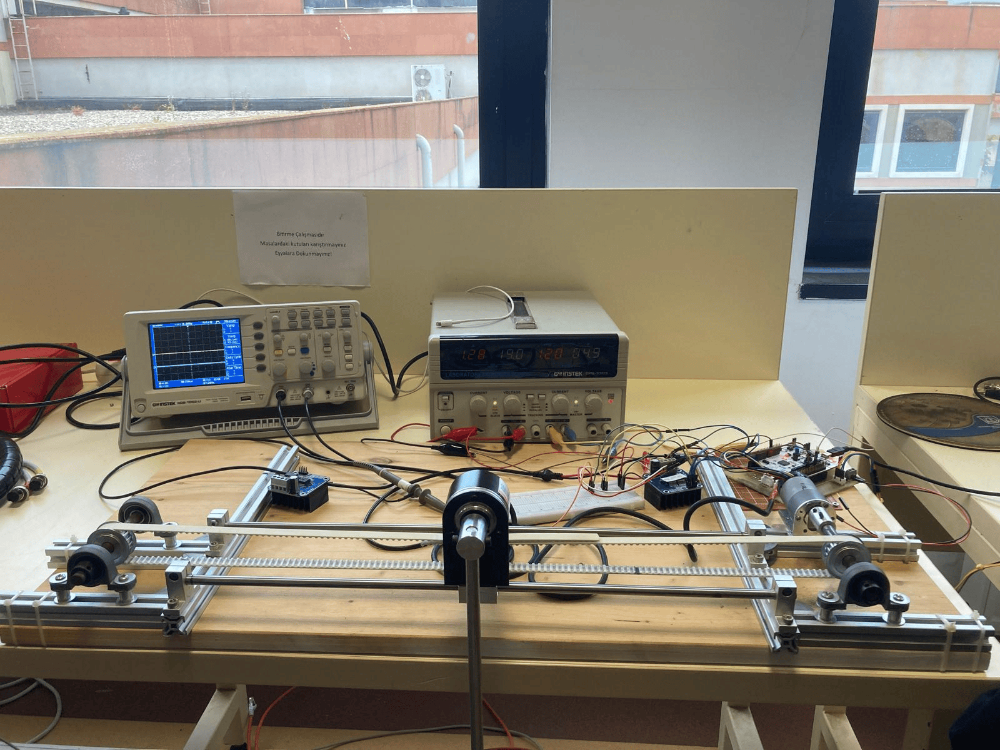

# NucleoF401_Cartpole

This project provides **firmware for the STM32 Nucleo-F401RE** board to act as a **hardware interface between motors/encoders and ROS 2 Humble**.  

The STM32 runs low-level drivers for **2 encoders and 1 DC motor**, while all high-level control (like **PID**) is done in ROS 2. This way, the microcontroller only handles real-time I/O and communication, and the digital twin in ROS 2 handles the intelligence.  

---

## System Overview

  
*Image 1: Physical cart-pole setup with motor and encoders.*

---

## Features
- **2 incremental encoders** → position and speed feedback  
- **1 DC motor** → driven by bidirectional PWM  
- **UART communication** with ROS 2 Humble  
  - Incoming: target speed commands (`s50.0\n`)  
  - Outgoing: (`enc2_count,enc2_speed,enc1_count,enc1_speed`)  
- Designed for **real-time hardware interface**; control logic stays in ROS 2  

---

## PID Control
> The PID controller is still a work in progress — I know it has some way to go, and we’re actively improving it.

  
*Image 2: PID control trials running from ROS 2.*

---

## Digital Twin

  
*Image 3: ROS 2 Humble RViz digital twin visualization.*

---

## Hardware Requirements
- **Board**: STM32 Nucleo-F401RE  
- **Motor driver**: H-bridge or similar, I used BTS7960  
- **DC motor** with incremental encoder
- **Second encoder** (for pendulum or additional measurement)  
- **USB TTL Converter** for UART (to ROS 2 serial bridge)   

---

## Build & Flash

This project uses **PlatformIO** structure.  
You can plug in your STM and upload your code directly.

For ROS2 code, you can refer to [here](https://github.com/enesbirlik/fuzzy_ws.git)